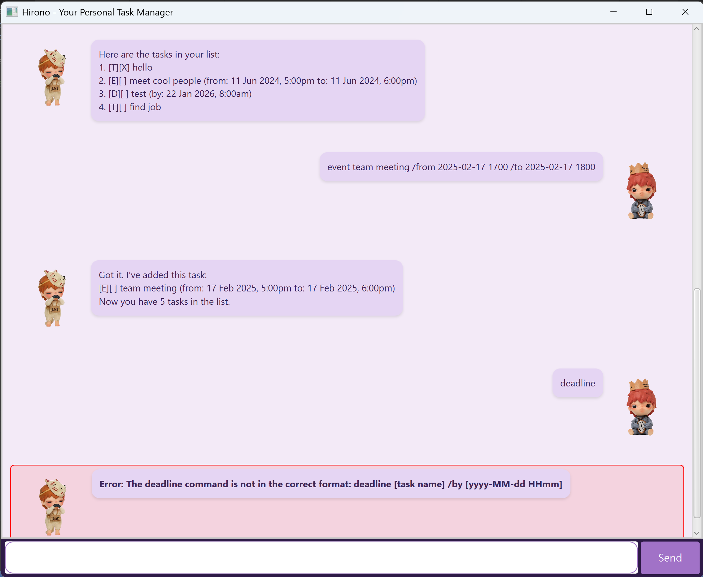

# Hirono: Your Personal Task Manager

> "The art of progress is to preserve order amid change and to preserve change amid order." – Alfred North Whitehead 🧠

Hirono is a **text-based task management application** designed to help you stay **organized and productive**. It offers both command-line and GUI interfaces to manage your daily tasks efficiently.



## ✨ Key Benefits

- ✅ **Easy to use** - Simple text-based commands for quick task management
- ⚡ **Fast & Efficient** - Lightweight and responsive application
- 🔧 **Customizable** - Supports multiple task types (ToDo, Deadlines, Events)

## 🚀 Features

### 📝 Task Management
- Add, delete, mark, and unmark tasks with simple commands
- Support for three task types:
  - **ToDo**: Simple tasks without deadlines
  - **Deadline**: Tasks with specific due dates
  - **Event**: Activities with start and end times

### 📅 Event Scheduling
- Keep track of deadlines and events with precision
- Manage time efficiently with detailed scheduling options
- Set specific dates and times for better organization

### 🔎 Search & Filter
- Find tasks quickly using keywords
- Filter tasks by date
- View all tasks due on a specific day

## 💡 Getting Started

### System Requirements
```
- Java 11 or higher
- 50MB free disk space
- Command-line interface or GUI terminal
```

### Installation
To run the application, use:
```
java -jar hirono.jar
```

## 📚 Command Reference

### Adding Tasks

1. **Todo Tasks**
```
todo [task name]
Example: todo read book
```

2. **Deadline Tasks**
```
deadline [task name] /by [yyyy-MM-dd HHmm]
Example: deadline finish report /by 2023-12-01 2359
```

3. **Event Tasks**
```
event [event name] /from [yyyy-MM-dd HHmm] /to [yyyy-MM-dd HHmm]
Example: event team meeting /from 2023-12-01 1400 /to 2023-12-01 1600
```

### Managing Tasks

1. **Mark/Unmark Tasks**
```
mark [task number]
unmark [task number]
```

2. **Delete Tasks**
```
delete [task number]
```

3. **Edit Tasks**
```
edit [task number]: [task-type] [new-description]
Examples:
edit 1: todo study mathematics
edit 2: deadline complete assignment /by 2023-12-15 2359
edit 3: event project meeting /from 2023-12-10 1000 /to 2023-12-10 1200
```

### Viewing and Finding Tasks

1. **List All Tasks**
```
list
```

2. **View Tasks by Date**
```
date [yyyy-MM-dd]
Example: date 2023-12-01
```

3. **Find Tasks by Keyword**
```
find [keyword]
Example: find book
```

### Date and Time Format

Use the following format for specifying dates and times:
```
Date: YYYY-MM-DD
Time: HHMM (24-hour format)

Examples:
2023-12-01 2359    # December 1st, 11:59 PM
2023-12-25 0900    # December 25th, 9:00 AM
```

## Example Output

When using the date command, you'll see output like this:
```
Here are the events and deadlines on 2026-01-22:
1. [D][ ] test (by: 22 Jan 2026, 8:00am)
```

---

Made with ❤️ by Hirono Developers